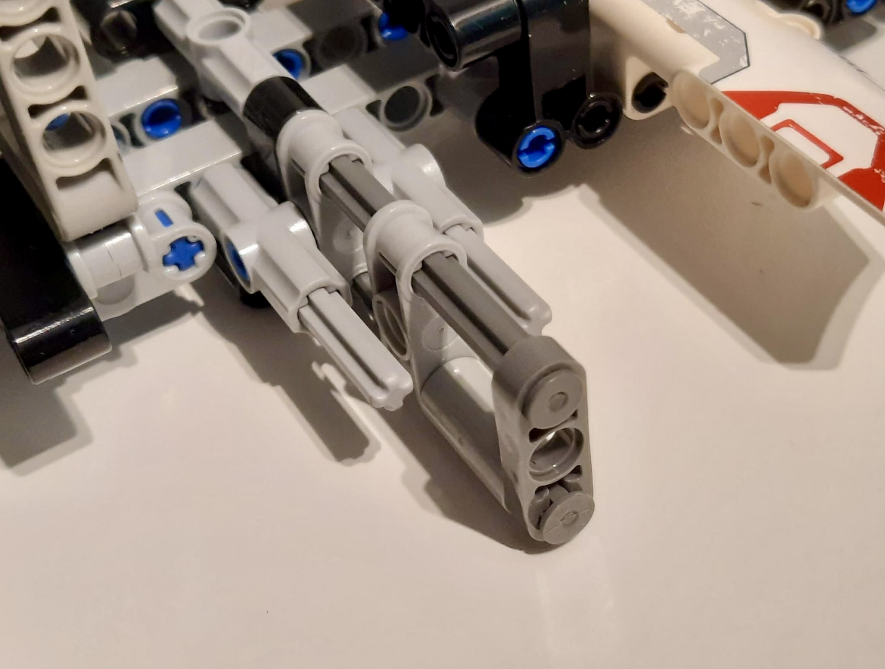

# 🏎️LineFollower🏎️

## 🧩About🧩
This Arduino project was developed during a one-day hackathon at the Faculty of Mathematics and Computer Science, University of Bucharest for the "Introduction to Robotics" 3rd-year course, 1st semester. It focused on the assembly and programming of a line-follower robot.
This project was made in teams of 3 people: [Ana-Iulia Staci](https://github.com/iuliastaci), [Tudor Coriciuc](https://github.com/Bucovina) and [Tudor-David Butufei](https://github.com/i2002). We formed Kuongshun team (inspiration for the name comes after the Arduino kit).

## 📌Task📌
The task of the project was to develop a line-follower robot that follows a black line on a white background as accurately as possible to finish the track. It had 3 attempts to get the best time. For maximum grade, the calibration of QTR-8A reflectance sensor had to be done automatically and the robot had to complete the final track in less than 20 seconds.
Our robot's best time was 16.752 seconds. Also, we have got 0.5 bonus points for the assembly design. 

## ⚒️Design and components details⚒️
For the line follower design, we used the following components:

- Arduino Uno R3 board
- QTR-8A reflectance sensor
- L293D motor driver
- LiPo battery as the power source
- 2 DC motors
- 2 wheels
- ball caster
- small breadboard
- connection wires
- zip-ties and skrews for connecting components to the chassis
- chassis made using LEGO bricks

The chassis has been made using LEGO bricks for better stability and improved looks. The design features a mechanism to easily open the battery compartment for replacement.
Various LEGO Technic bricks (such as beams, half beams and axles) have been used for the main body. LEGO panel fairings have been used to improve design aesthetics.
The most challenging part of the design was finding a way to attach the motors to the LEGO chassis without compromising stability.

## 📝Functionality and implementation details📝
To achieve the task, the speed of our robot's motors was controlled by a PID controller and at the start of the track, an automatic calibration was done. 

- #### Automatical calibration
This calibration consisted of moving the robot left and right alongside the black line to ensure that each sensor "sees" it and the white background to determine the min and max luminosity values. At the end of the calibration routine, the robot returns to the center of the line.

- #### PID Controller
A PID controller, which stands for Proportional-Integral-Derivative, is a widely used feedback control system. The three components of a PID controller work together to achieve optimal control:

1. _Proportional_: The P component responds to the current error between the setpoint and the actual output. It generates a control output that is directly proportional to this error, meaning it acts to reduce the difference between the setpoint and the actual output.
2. _Integral_: The I component addresses the accumulated error over time. It adds a corrective action based on the integral (sum) of past errors, helping to eliminate any steady-state error that may persist with the proportional control alone.
3. _Derivative_: The D component anticipates future errors by considering the rate of change of the error. It introduces a corrective action proportional to the rate at which the error is changing, helping to dampen oscillations and improve system stability.

By combining these three components, the PID controller aims to minimize the difference between the desired setpoint and the actual output, providing a balance between responsiveness, stability, and disturbance rejection.

- #### PID Control System calibration 
For this project, the integral part of the PID control system was not used.
To choose the values for Kp and Kd gains, we mostly used the trial-and-error method; we started by choosing a value for Kp and doing a bunch of test drives while adjusting the Kp value. After the robot was following the track only with some overshoot at curves, we introduced the value of the Kd gain. For Kd gain's value, we have also looked over [the Ziegler-Nichols tuning method](https://en.wikipedia.org/wiki/Ziegler%E2%80%93Nichols_method), just to find a link between Kp and Kd values and without calculating the oscillation period.
Our final values for gains were Kp = 7.75 and Kd = 30.

- #### Additional optimizations
During testing, we discovered that when one of the motors reaches a value under 100, the other motor may not have enough power to push the robot forward by itself. Therefore we included a test where if there is only one motor active, we boost its speed.

## 📷Setup photo📷

  
Main body

  

  
Battery compartment

  

  
Motor mount

  

  
Full setup

  
  
  

## 🎥Video🎥
Click [here](https://youtube.com/shorts/qIztd3UylrY) to watch our line-follower robot on the final track.
